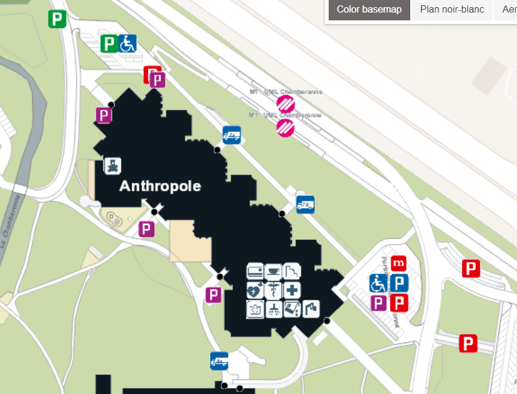
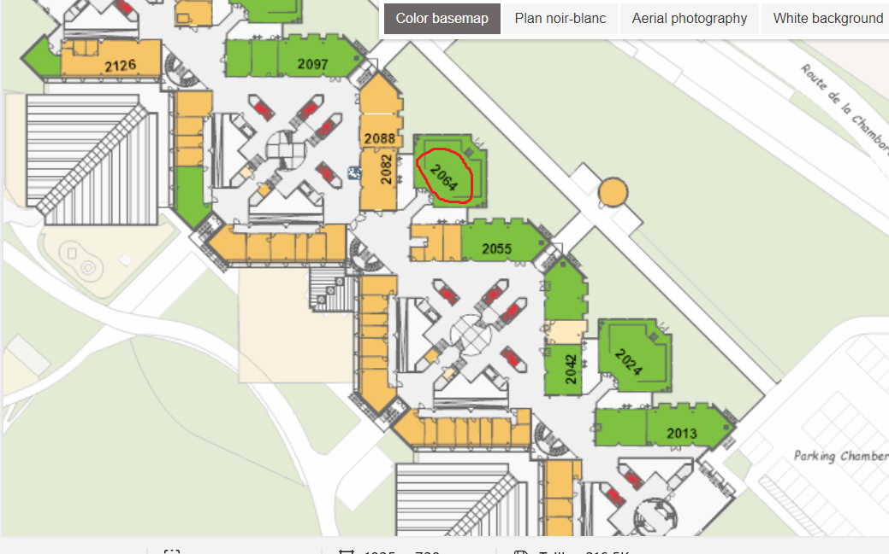
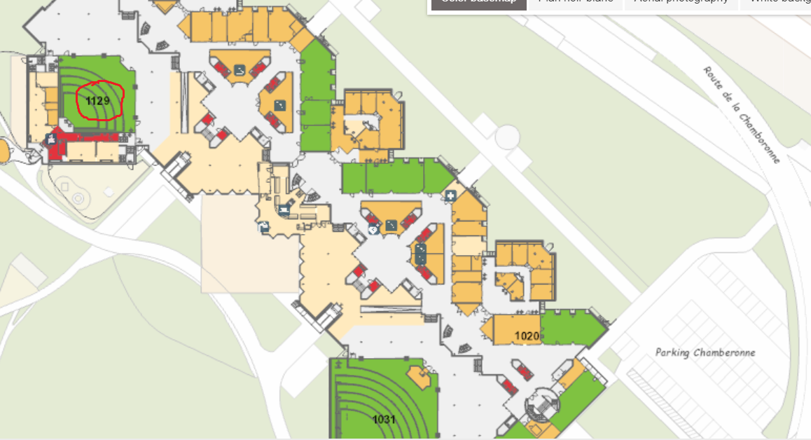

# Econometric Society Summer School and conference in Dynamic Structural Econometrics (DSE2023)

## Topic: Deep Learning for Solving and Estimating Dynamic Models

This public repository contains the training materials, tutorials, lecture notes, and code for the
DSE2023 summer school and conference, held at the Department of Economics, University of Lausanne, Switzerland from August 21-26th, 2023.

**Anyone is free to use this teaching material. In the latter case, a reference to this repository would however would be expected**

* [Website of DSE 2023](https://dseconf.org/dse2023)

Materials will be added to the repository throughout the course, which will require that students either update their copy of the repository, or download/checkout a new copy of the repository.

### DSE2023 Lecturers, invited speakers, and organizers of DSE2023 (in alphabetical order)

* [Marlon Azinovic](https://sites.google.com/view/marlonazinovic/home?authuser=0) (University of Pennsylvania)
* [Hui Chen](https://www.mit.edu/~huichen/) (Massachusetts Institute of Technology)
* [Jesus Fernandez-Villaverde](https://www.sas.upenn.edu/~jesusfv/) (University of Pennsylvania)
* [Fedor Iskhakov](https://fedor.iskh.me/) (Australian National University)
* [Felix Kubler](https://sites.google.com/site/fkubler/) (University of Zurich / Swiss Finance Institute)
* [Semyon Malamud](https://www.sfi.ch/en/people/semyon-malamud) (EPFL / Swiss Finance Institute)
* [Lilia Maliar Zakladna](https://lmaliar.ws.gc.cuny.edu/) (The City University of New York)
* [Robert A. Miller](http://www.comlabgames.com/ramiller/) (Carnegie Mellon University)
* [Sanjog Misra](https://www.chicagobooth.edu/faculty/directory/m/sanjog-misra) (University of Chicago Booth School of Business)
* [Whitney Newey](https://economics.mit.edu/people/faculty/whitney-newey) (Massachusetts Institute of Technology)
* [John Rust](https://editorialexpress.com/jrust/) (Georgetown University)
* [Rafael Sarmiento](https://www.linkedin.com/in/rafael-sarmiento-p%C3%A9rez-74300798/?originalSubdomain=ch) (Swiss National Supercomputing Center)
* [John Stachurski](https://johnstachurski.net/) (Australian National University)
* [Simon Scheidegger](https://sites.google.com/site/simonscheidegger/home?authuser=0) (University of Lausanne)
* [Bertel Schjerning](http://bschjerning.com/) (University of Copenhagen)
* [Yucheng Yang](https://sites.google.com/site/yangyucheng1993) (University of Zurich/Princeton)
 
 
### Announcements 

We will be using Zulip to post news and links relevant to the event: you should have received an invitation to join the Summer School Zulip workspace.

### Online Participation 

We will be using Zoom throughout the summer school and conference: you should have received an invitation to join the Zoom space.

## Nuvolos Cloud - Our Computational Infrastructure

We will be using [Nuvolos Cloud](https://nuvolos.cloud) throughout the summer school as computational Infrastructure: you should have received an invitation to join this cloud.

- Nuvolos Support: <support@nuvolos.cloud>

### Time table of the Summer School

* Registration will take plance on Monday, August 21st, from 8:30-9:00 am at Anthropole, room Anthropole 2064.

* For the Ph.D. student organized hang-out session on Tuesday, August 22nd, from 18:30 onward, please fill out [this form](https://docs.google.com/spreadsheets/d/1HJmlHOu8mqt9k0usIFmEhnZN3dpvZcT_llZ7WR2noAA/edit#gid=0)

* For the Pizza and coding event that takes place on Wednesday, August 23rd, please fill out [this form](https://docs.google.com/spreadsheets/d/1Xz_511rzqZnbxzwxen9iHEK_ZstVV__d5--SpkwB40s/edit#gid=0) no later than Monday, August 21st.

**Lecture** | **Date** | **Time** | **Topic** | **Lecturer**
-----|-----|------|------|------
01   | 08.21.2023 | 09:00 - 10:20 | [Introduction to deep learning, Tensorflow and, Nuvolos cloud](01_Scheidegger) | Scheidegger
02   | 08.21.2023 | 10:30 - 11:50 | [Introduction to dynamic structural econometrics](02_Rust) | Rust
03   | 08.21.2023 | 13:00 - 14:20 | [Numerical Dynamic Programing / best practices in Python](03_Stachurski) | Stachurski
04   | 08.21.2023 | 14:30 - 15:50 | [Sturctual estimation of dynamic discrete choice models (MPEC and NFXP)](04_Schjerning) | Schjerning
05   | 08.21.2023 | 16:00 - 17:20 | [Stationary and Nonstationary Equilibrium in Durable Goods Markets](05_Iskhakov_Rust_Schjerning) | Iskhakov, Rust, Schjerning
06   | 08.22.2023 | 09:00 - 10:20 | [Deep Equilibrium Nets](06_Scheidegger) | Scheidegger
07   | 08.22.2023 | 10:30 - 11:50 | [DeepHAM: A global solution method for heterogeneous agent models with aggregate shocks](07_Yang) | Yang
08   | 08.22.2023 | 13:00 - 14:20 | [Deep Uncertainty Quantification: With an Application to Integrated Assessment Models](08_Kubler) | Kubler
09   | 08.22.2023 | 14:30 - 15:50 | [Exploiting symmetry in high-dimensional DP models](09_Fernandez_Villaverde) | Fernandez-Villaverde
10   | 08.22.2023 | 16:00 - 17:20 | [Using deep learning to solve heterogeneous agents dynamic equilibrium problems](10_Fernandez_Villaverde) | Fernandez-Villaverde
11   | 08.23.2023 | 09:00 - 10:20 | [Conditional independence and the inversion theorem](11_Miller) | Miller
12   | 08.23.2023 | 10:30 - 11:50 | [Unobserved Heterogeneity and Finite Dependence](12_Miller) | Miller
13   | 08.23.2023 | 13:00 - 14:20 | [Machine Learning, CCPs, and Dynamic Discrete Choice](13_Newey) | Newey
14   | 08.23.2023 | 14:30 - 15:50 | [Deep Learning for Individual Heterogeneity](14_Misra) | Misra
15   | 08.23.2023 | 16:00 - 17:20 | [High-performance Computing with Python for Deep Learning](15_Sarmiento) | Sarmiento
16   | 08.23.2023 | 18:30 - 20:00 | [Pizza and Coding](16_Azinovic) | Azinovic
17   | 08.26.2023 | 09:00 - 10:20 | [Deep Surrogates for Structural Estimation](17_Chen) | Chen
18   | 08.26.2023 | 10:30 - 11:50 | [Random Matrix Theory and Machine Learning in Asset Pricing](18_Malamud) | Malamud
19   | 08.26.2023 | 13:00 - 14:20 | [Advances in dynamic programming: theory and algorithms](19_Stachurski) | Stachurski
20   | 08.26.2023 | 14:30 - 15:50 | [Endogenous grid point methods and machine learning](20_Iskhakov) | Iskhakov
21   | 08.26.2023 | 16:00 - 16:30 | Wrap-up and adjourn | Rust

* Updates of the tentative schedule for the DSE2023 summer school can be found [here](https://dseconf.org/dse2023course-program#).

### Time table of the Conference (August 24 and 25th, 2023)

* The tentative schedule for the DSE2023 conference can be found [here](https://dseconf.org/dse2023conf).

* Registration will be in front of Anthropole, room 1129.

* Coffe breaks will be in front of Anthropole, room 1031.

* Conference dinner will take place on August 24th, 18:30, at the [Restaurant du Theatre](https://www.restaurant-du-theatre.ch). Please fill out [this form](https://docs.google.com/spreadsheets/d/1orcnj4ibvyT-lkrby8sx7wYBufF0yOwmNaSx1DU2TYI/edit#gid=0) no later than Monday, August 21st, 2023, if you plan on attending.

* [Econ-Ark](https://econ-ark.org/) sponsored reception will take place on August 25th, 18:00, at the Vortex at Le Perchoir Rooftop-Bar at the Vortex building at UNIL  Please fill out [this form](https://framadate.org/qBiKwE9apYDBYDh3)

### Prerequisites

* Basic programming in Python (see [this link](https://python-programming.quantecon.org/intro.html) for a thorough introduction)
* Basic calculus and probability ([Mathematics for Machine learning](https://mml-book.github.io/) provides a good overview of skills participants are required to be fluent in).
* Basic econometrics

### Location of the Summer School and Conference

DSE2023 will take place at the University of Lausanne, in the building called *Anthropole*.

* You can find all plans of the University bulidings [here](https://planete.unil.ch/plan).

* This is the Anthropole building:

* The **summer school** takes place in Anthropole room 2064 (marked with a red circle).

* The **conference** takes place in Anthropole room 1129 (marked with a red circle).

